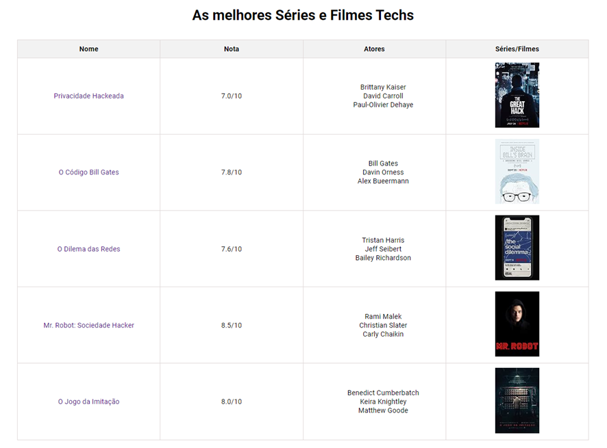

# Projeto Vem Ser Tech - Ada/iFood - Exercício 4 - Trabalhando com tabelas

→ Criar uma tabela com no mínimo 4 filmes ou séries famosos, essa tabela deve ter as colunas com:

- Nome
- Nota
- Atores
- Imagem

→ O nome deve ter um link que direciona para página da série ou filme do site [imdb.com](https://www.imdb.com/)

→ A imagem deve ter um width de 100px no máximo.

